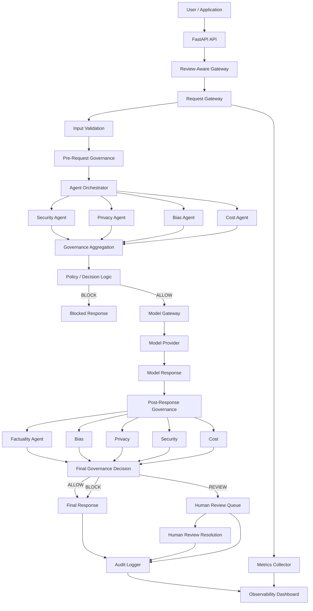

# ControlPlane.ai

> **AI Governance, Observability, Factuality & Human Review**

ControlPlane.ai is a prototype AI governance platform designed to place
a governance and observability layer around AI/LLM applications. Instead
of treating an LLM call as a direct `prompt → response` interaction,
ControlPlane introduces policy-driven checks before and after model
execution and records the resulting decisions, risks, costs, evidence,
reviews, and operational metrics.

**Live prototype:** [ControlPlane_AI](https://controlplane-ai-bhn7.onrender.com)
**Public repository:**
[ControlPlane_AI](https://github.com/n-kaushik1/Controlplane_AI_project.git)
**License:** MIT

---

## Prototype Demo

### 🎥 Demo Video

**[▶ Watch the ControlPlane.ai Prototype Demo](https://drive.google.com/file/d/17j1ylfG507OqPwjgSTJWkZZlegKaGf30/view?usp=sharing)**


## Table of Contents

- [Overview](#overview)
- [Problem Statement](#problem-statement)
- [Solution](#solution)
- [Key Capabilities](#key-capabilities)
- [Solution Architecture](#solution-architecture)
- [Request Lifecycle](#request-lifecycle)
- [Governance Architecture](#governance-architecture)
- [Factuality and Evidence](#factuality-and-evidence)
- [Human Review](#human-review)
- [Observability and Auditability](#observability-and-auditability)
- [Policy Profiles](#policy-profiles)
- [Project Structure](#project-structure)
- [Technology Stack](#technology-stack)
- [Dependencies](#dependencies)
- [Configuration](#configuration)
- [Local Installation](#local-installation)
- [Running the Application](#running-the-application)
- [Using the API](#using-the-api)
- [Dashboard](#dashboard)
- [Testing](#testing)
- [Deployment](#deployment)
- [Design Decisions](#design-decisions)
- [Limitations and Prototype Scope](#limitations-and-prototype-scope)
- [Future Improvements](#future-improvements)
- [License](#license)

---

## Overview

ControlPlane.ai is implemented as a FastAPI-based governance middleware
layer with a browser dashboard.

The central design principle is:

```text
Application / User
        |
        v
+----------------------+
|   ControlPlane.ai    |
| Governance Gateway   |
+----------------------+
        |
        +--------------------+
        |                    |
        v                    v
Pre-request checks     Model / LLM Provider
        |                    |
        +---------+----------+
                  |
                  v
        Post-response checks
                  |
        +---------+----------+
        |                    |
        v                    v
   Final Decision      Audit + Metrics
        |
        +--------------------------+
        |            |             |
        v            v             v
      ALLOW        REVIEW        BLOCK
                       |
                       v
                Human Reviewer
```

The platform is intended to demonstrate how governance can become an
executable part of an AI system rather than a separate documentation or
compliance activity.

---

## Problem Statement

AI systems can produce useful responses quickly, but production
deployment introduces additional concerns:

- Unsafe or malicious inputs
- Privacy and PII exposure
- Potentially biased outputs
- Factual errors and unsupported claims
- Uncontrolled inference cost
- Unclear governance decisions
- Lack of human escalation
- Limited auditability
- Difficulty understanding model behavior over time

A simple LLM integration generally focuses on generating a response.
ControlPlane.ai focuses on the broader lifecycle:

```text
Request
  ↓
Validate
  ↓
Govern
  ↓
Generate
  ↓
Verify
  ↓
Govern Again
  ↓
Decide
  ↓
Audit / Measure / Review
```

---

## Solution

ControlPlane.ai introduces a runtime gateway between the application and
the model provider.

The gateway:

1.  Receives and validates the request.
2.  Generates or preserves a request identifier.
3.  Runs pre-request governance checks.
4.  Aggregates governance-agent results.
5.  Applies policy-driven decision logic.
6.  Blocks unsafe requests before model execution when required.
7.  Sends allowed requests to the model provider.
8.  Runs post-response governance, including factuality checks.
9.  Produces a final governance decision.
10. Creates a human-review item when the decision is `REVIEW`.
11. Records audit information.
12. Collects operational metrics.
13. Exposes the state through API endpoints and the dashboard.

---

# Key Capabilities

## 1. Security Governance

The security agent checks request/response content for security-related
risks and contributes a standardized governance result.

## 2. Privacy Governance

The privacy agent is responsible for identifying privacy/PII-related
concerns.

## 3. Bias Governance

The bias agent evaluates text for potential bias-related concerns.

## 4. Cost Governance

The cost agent estimates model usage/cost information and contributes
cost-related governance signals.

## 5. Factuality Governance

The factuality subsystem:

- Extracts claims from generated responses.
- Retrieves relevant evidence.
- Verifies claims against available evidence.
- Produces verification information.
- Feeds factuality results back into governance.

## 6. Human Review

Requests whose final governance decision is `REVIEW` can be placed into
a review queue.

Reviewers can:

- View pending reviews.
- Inspect the request and generated response.
- Review the risk and reason.
- Resolve the review.
- Provide reviewer identity.
- Add reviewer comments.
- Produce a final decision such as `ALLOW`, `BLOCK`, `EDIT`, or
  `REJECT`.

## 7. Audit Logging

Governance and review events are recorded for traceability.

The project includes JSONL-based audit/feedback storage:

```text
logs/audit.jsonl
logs/feedback.jsonl
```

## 8. Observability

The monitoring subsystem exposes:

- Total request volume
- Decision counts
- Decision rates
- Risk statistics
- Latency statistics
- Model latency
- Estimated cost
- Human-review statistics
- Recent governed request events

---

# Solution Architecture



---

# Request Lifecycle

The runtime request path is intentionally separated into stages.

## Stage 1 --- Request Reception

The request enters the API through:

```text
POST /api/generate
```

The request contains a prompt and optional metadata.

A request ID is preserved when supplied or generated when missing.

## Stage 2 --- Input Validation

The gateway verifies that:

- The prompt is a string.
- The prompt is not empty.

Invalid input is safely blocked.

## Stage 3 --- Pre-Request Governance

The `AgentOrchestrator` coordinates governance agents before the model
is called.

Current governance components include:

```text
Security
Privacy
Bias
Cost
```

Their results are standardized through the agent result abstraction and
aggregated by the orchestrator.

## Stage 4 --- Policy Decision

Governance results are used to determine the request action.

Conceptually:

```text
ALLOW
MODIFY
REVIEW
BLOCK
```

The policy layer contains configurable risk, uncertainty, cost, privacy,
bias, security, and factuality requirements.

## Stage 5 --- Model Execution

If the request is allowed to proceed, the gateway calls the configured
model provider through the model abstraction.

The architecture deliberately separates the model provider from
governance logic.

## Stage 6 --- Post-Response Governance

The generated response is inspected again.

This is important because a safe request can still produce an unsafe,
biased, privacy-sensitive, expensive, or factually unsupported response.

## Stage 7 --- Factuality Verification

For factual responses, the factuality subsystem can:

```text
Generated Response
        ↓
Claim Extraction
        ↓
Evidence Retrieval
        ↓
Claim Verification
        ↓
Factuality Result
```

Factuality results are incorporated into the broader governance
decision.

## Stage 8 --- Final Decision

The system produces a final governance action.

Typical actions are:

```text
ALLOW
BLOCK
REVIEW
```

## Stage 9 --- Human Review

When the final action is `REVIEW`, the review-aware gateway creates a
review item.

The review preserves the request ID so that the original request,
governance decision, review, feedback, and audit events can be
correlated.

## Stage 10 --- Audit and Metrics

The request lifecycle contributes to:

- Audit logs
- Request metrics
- Risk metrics
- Cost metrics
- Performance metrics
- Review metrics
- Dashboard observability

---

# Governance Architecture

The governance system is deliberately modular.

```text
                    +----------------+
                    | AgentOrchestrator|
                    +--------+-------+
                             |
          +------------------+------------------+
          |          |          |        |       |
          v          v          v        v       v
      Security    Privacy     Bias     Cost   Factuality
          |          |          |        |       |
          +----------+----------+--------+-------+
                             |
                             v
                    Standardized Results
                             |
                             v
                    Governance Aggregation
                             |
                             v
                      Policy Decision
```

The `RequestGateway` does not need to know the implementation details of
each agent. It consumes the standardized orchestration result.

This keeps governance logic extensible.

---

# Factuality and Evidence

Factuality is implemented as a governance component rather than as an
isolated post-processing utility.

Relevant modules include:

```text
app/core/factuality_engine.py
app/core/evidence_retriever.py
app/core/web_evidence_retriever.py

app/evidence/claims.py
app/evidence/retriever.py
app/evidence/store.py
app/evidence/verifier.py

app/agents/factuality_agent.py
```

The project also includes local evidence data:

```text
data/evidence.json
data/evidence_index.npz
```

The factuality pipeline is conceptually:

```text
Response
   |
   v
Claim Extraction
   |
   v
Evidence Retrieval
   |
   v
Evidence Matching
   |
   v
Claim Verification
   |
   v
Factuality Governance Result
```

The factuality agent is integrated into the main governance orchestrator
so factuality can influence the final response decision.

---

# Human Review

Human review is implemented as a separate integration layer around the
existing gateway.

```text
RequestGateway
      |
      v
Governance Decision
      |
      +------ ALLOW/BLOCK ------> Response
      |
      +------ REVIEW -----------> ReviewService
                                      |
                                      v
                                 ReviewQueue
                                      |
                                      v
                                Human Reviewer
                                      |
                                      v
                              Final Decision
                                      |
                                      v
                              Feedback + Audit
```

The review subsystem includes:

```text
app/feedback/models.py
app/feedback/review_queue.py
app/feedback/store.py
app/feedback/service.py
app/gateway/review_gateway.py
```

Review resolution also supports `REJECT`, which is surfaced as a
rejected review status.

---

# Observability and Auditability

The monitoring subsystem is implemented in:

```text
app/monitoring/metrics.py
app/monitoring/aggregator.py
```

The API exposes monitoring information through endpoints such as:

```text
GET /api/metrics
GET /api/metrics/dashboard
GET /api/metrics/events

GET /api/metrics/decisions
GET /api/metrics/risk
GET /api/metrics/performance
GET /api/metrics/cost
GET /api/metrics/reviews

GET /api/observability
GET /api/observability/metrics
GET /api/observability/events
GET /api/observability/health
```

The audit subsystem is implemented in:

```text
app/audit/logger.py
```

Audit events are intended to provide traceability across governed
requests and human-review actions.

---

# Policy Profiles

The policy layer defines use-case-specific governance profiles.

Current profiles include:

Profile Block Risk Review Risk Max Uncertainty Max Cost

---

`customer_support` 0.85 0.60 0.75 0.05
`internal_copilot` 0.80 0.55 0.70 0.10
`decision_support` 0.65 0.35 0.45 0.20
`regulated` 0.50 0.25 0.30 0.25

All current profiles require factual verification and enforce privacy,
bias, and security checks.

These thresholds are defined in:

```text
app/policies/policies.py
```

and policy behavior is handled by:

```text
app/policies/engine.py
```

---

# Project Structure

```text
Controlplane_AI_project/
│
├── app/
│   ├── __init__.py
│   ├── main.py
│   │
│   ├── actions/
│   │   └── executor.py
│   │
│   ├── agents/
│   │   ├── base.py
│   │   ├── security_agent.py
│   │   ├── privacy_agent.py
│   │   ├── bias_agent.py
│   │   ├── cost_agent.py
│   │   ├── factuality_agent.py
│   │   └── orchestrator.py
│   │
│   ├── api/
│   │   └── routes.py
│   │
│   ├── audit/
│   │   └── logger.py
│   │
│   ├── context/
│   │   ├── request_context.py
│   │   └── risk_profiles.py
│   │
│   ├── core/
│   │   ├── config.py
│   │   ├── factuality_engine.py
│   │   ├── evidence_retriever.py
│   │   └── web_evidence_retriever.py
│   │
│   ├── evidence/
│   │   ├── claims.py
│   │   ├── retriever.py
│   │   ├── store.py
│   │   └── verifier.py
│   │
│   ├── feedback/
│   │   ├── models.py
│   │   ├── review_queue.py
│   │   ├── service.py
│   │   └── store.py
│   │
│   ├── gateway/
│   │   ├── model_gateway.py
│   │   ├── request_gateway.py
│   │   └── review_gateway.py
│   │
│   ├── models/
│   │   └── provider.py
│   │
│   ├── monitoring/
│   │   ├── metrics.py
│   │   └── aggregator.py
│   │
│   └── policies/
│       ├── engine.py
│       └── policies.py
│
├── dashboard/
│   ├── index.html
│   ├── app.js
│   └── style.css
│
├── data/
│   ├── evidence.json
│   └── evidence_index.npz
│
├── logs/
│   ├── audit.jsonl
│   └── feedback.jsonl
│
├── tests/
│   ├── test_actions.py
│   ├── test_agents.py
│   ├── test_audit.py
│   ├── test_context.py
│   ├── test_controlplane_e2e.py
│   ├── test_evidence.py
│   ├── test_factuality_gateway_integration.py
│   ├── test_factuality_review_e2e.py
│   ├── test_feedback.py
│   ├── test_gateway.py
│   ├── test_metrics_api.py
│   ├── test_monitoring.py
│   ├── test_observability.py
│   ├── test_policy.py
│   └── test_review_integration.py
│
├── requirements.txt
└── README.md
```

---

# Technology Stack

Layer Technology

---

Backend API FastAPI
Application server Uvicorn
Validation / models Pydantic
Configuration pydantic-settings
Factuality embeddings Sentence Transformers
Numerical processing NumPy
HTTP testing / API client HTTPX
Testing Pytest
Frontend HTML, CSS, JavaScript
Deployment Render
Source control Git + GitHub

---

# Dependencies

The project's `requirements.txt` contains:

```text
fastapi
uvicorn
pytest
httpx
pydantic
pydantic-settings
sentence-transformers
numpy
```

Install them with:

```bash
pip install -r requirements.txt
```

### Dependency roles

- **FastAPI** --- REST API and application framework.
- **Uvicorn** --- ASGI application server.
- **Pydantic** --- request/data validation.
- **pydantic-settings** --- environment-based configuration.
- **Sentence Transformers** --- semantic embedding support for
  factuality/evidence retrieval.
- **NumPy** --- evidence index and numerical operations.
- **HTTPX** --- HTTP/API testing.
- **Pytest** --- automated testing.

---

# Configuration

The application uses environment-backed settings.

Important configuration values include:

```text
APP_NAME
ENVIRONMENT
DEBUG

MODEL_PROVIDER
MODEL_NAME

DEFAULT_RISK_THRESHOLD
DEFAULT_COST_BUDGET

API_HOST
API_PORT

FACTUALITY_ENABLED
FACTUALITY_EMBEDDING_MODEL
FACTUALITY_TOP_K
FACTUALITY_MIN_SIMILARITY
FACTUALITY_MAX_CLAIMS

EVIDENCE_FILE
EVIDENCE_INDEX_FILE

HF_TOKEN
```

A local `.env` file must be used for development.

### Example

```env
APP_NAME=ControlPlane.ai
ENVIRONMENT=development
DEBUG=true

MODEL_PROVIDER=mock
MODEL_NAME=mock-model

DEFAULT_RISK_THRESHOLD=0.50
DEFAULT_COST_BUDGET=0.01

API_HOST=127.0.0.1
API_PORT=8000

FACTUALITY_ENABLED=true
FACTUALITY_EMBEDDING_MODEL=sentence-transformers/all-MiniLM-L6-v2
FACTUALITY_TOP_K=5
FACTUALITY_MIN_SIMILARITY=0.55
FACTUALITY_MAX_CLAIMS=20

EVIDENCE_FILE=data/evidence.json
EVIDENCE_INDEX_FILE=data/evidence_index.npz
```

For hosted deployments, secrets should be configured through the hosting
provider's environment-variable system rather than committed to Git.

**Never commit API keys, tokens, passwords, or private credentials to
the public repository.**

---

# Local Installation

## 1. Clone the repository

```bash
git clone https://github.com/n-kaushik1/Controlplane_AI_project.git
cd Controlplane_AI_project
```

## 2. Create a virtual environment

### Windows PowerShell

```powershell
python -m venv .venv
.venv\Scripts\Activate.ps1
```

### macOS / Linux

```bash
python3 -m venv .venv
source .venv/bin/activate
```

## 3. Install dependencies

```bash
pip install -r requirements.txt
```

## 4. Configure environment variables

Create a local `.env` file if required:

```text
.env
```

Add the required configuration values for your environment.:
MODEL_PROVIDER="openrouter"
MODEL_NAME="openrouter/free"
MODEL_BASE_URL="https://openrouter.ai/api/v1"
MODEL_TEMPERATURE="0.2"
MODEL_MAX_TOKENS="512"
MODEL_TIMEOUT_SECONDS="60"
MODEL_API_KEY=your_real_openrouter_key
TAVILY_API_KEY=your_real_tavily_key

---

# Running the Application

Start the FastAPI server with:

```bash
uvicorn app.main:app --reload --host 127.0.0.1 --port 8000
```

The API will be available at:

```text
http://127.0.0.1:8000
```

FastAPI's interactive API documentation is available at:

```text
http://127.0.0.1:8000/docs
```

The deployed application serves the ControlPlane.ai dashboard from the
same web service.

---

# Using the API

## Health Check

```http
GET /api/health
```

Example:

```bash
curl http://127.0.0.1:8000/api/health
```

The health response reports service health and whether the major
governance components are enabled.

---

## Generate a Governed Response

```http
POST /api/generate
```

Example request:

```json
{
  "prompt": "Explain the customer support policy.",
  "metadata": {
    "risk_profile": "customer_support"
  }
}
```

Example curl:

```bash
curl -X POST "http://127.0.0.1:8000/api/generate" \
  -H "Content-Type: application/json" \
  -d "{\"prompt\":\"Explain the customer support policy.\"}"
```

The response contains the governed model result and associated
governance information.

---

# Human Review API

## List Pending Reviews

```http
GET /api/reviews
```

## Get a Review

```http
GET /api/reviews/{review_id}
```

## Resolve a Review

```http
POST /api/reviews/{review_id}/resolve
```

Example request:

```json
{
  "final_decision": "ALLOW",
  "reviewer": "admin",
  "comment": "Reviewed and approved."
}
```

The review workflow also supports final outcomes such as `BLOCK`,
`EDIT`, and `REJECT` according to the review implementation.

---

# Feedback API

```http
GET /api/feedback/summary
```

This exposes aggregated feedback information from resolved reviews.

---

# Metrics API

The monitoring API is divided into focused endpoints.

### Overall metrics

```http
GET /api/metrics
```

### Dashboard summary

```http
GET /api/metrics/dashboard
```

### Recent events

```http
GET /api/metrics/events
```

### Decisions

```http
GET /api/metrics/decisions
```

### Risk

```http
GET /api/metrics/risk
```

### Performance

```http
GET /api/metrics/performance
```

### Cost

```http
GET /api/metrics/cost
```

### Reviews

```http
GET /api/metrics/reviews
```

---

# Observability API

Additional observability endpoints are available:

```text
GET /api/observability
GET /api/observability/metrics
GET /api/observability/events
GET /api/observability/health
```

For example:

```bash
curl "http://127.0.0.1:8000/api/observability/health"
```

---

# Dashboard

The frontend is contained in:

```text
dashboard/
├── index.html
├── app.js
└── style.css
```

The dashboard provides an operational view of the governance system.

It is organized around areas such as:

- Overview
- Requests
- Governance
- Factuality
- Human Reviews
- Audit Log
- Metrics

The dashboard can display request volume, decisions, risk, review state,
factuality information, and other observability signals exposed by the
API.

For the hosted prototype, the dashboard and FastAPI backend are served
from the same Render web service.

---

# Testing

The project includes unit, integration, and end-to-end tests.

Run the full suite with:

```bash
pytest -q
```

Test coverage is organized around:

```text
tests/test_gateway.py
tests/test_agents.py
tests/test_policy.py
tests/test_context.py
tests/test_evidence.py
tests/test_factuality_gateway_integration.py
tests/test_factuality_review_e2e.py
tests/test_review_integration.py
tests/test_feedback.py
tests/test_audit.py
tests/test_actions.py
tests/test_monitoring.py
tests/test_metrics_api.py
tests/test_observability.py
tests/test_controlplane_e2e.py
```

The tests validate different layers of the implementation, including:

- Gateway behavior
- Governance agents
- Policy evaluation
- Context handling
- Evidence retrieval and verification
- Factuality integration
- Human-review integration
- Feedback persistence
- Audit logging
- Monitoring
- Metrics APIs
- Observability
- End-to-end request flow

---

# Deployment

The public prototype is deployed using Render.

## Render Web Service

Recommended configuration:

```text
Language:
Python 3

Branch:
main

Build Command:
pip install -r requirements.txt

Start Command:
uvicorn app.main:app --host 0.0.0.0 --port $PORT
```

The service is currently available at:

```text
https://controlplane-ai-bhn7.onrender.com
```

### Environment Variables

Configure deployment secrets and model settings in Render's
environment-variable section.

Typical variables may include:

```text
MODEL_PROVIDER
MODEL_NAME
MODEL_API_KEY
MODEL_BASE_URL
MODEL_TEMPERATURE
MODEL_MAX_TOKENS
MODEL_TIMEOUT_SECONDS
TAVILY_API_KEY
HF_TOKEN
```

Only variables actually required by the selected runtime configuration
should be populated.

### Deployment Flow

```text
GitHub
   |
   | push to main
   v
Render Auto Deploy
   |
   v
Install Python dependencies
   |
   v
Start Uvicorn
   |
   v
FastAPI Application
   |
   +------------------+
   |                  |
   v                  v
REST API          Dashboard
```

---

# Design Decisions

## Modular Governance

Governance checks are implemented as independent agents.

This allows new governance dimensions to be added without rewriting the
core request gateway.

## Standardized Agent Results

Agents expose standardized results so the orchestrator and gateway do
not need to depend on agent-specific implementation details.

## Gateway-Based Enforcement

Governance happens at the gateway rather than only in the UI.

This means decisions can be enforced consistently for API requests even
when a request does not originate from the dashboard.

## Pre- and Post-Generation Checks

Both the input and generated response are governed.

This prevents the system from assuming that a safe input necessarily
produces a safe output.

## Separate Human Review Layer

Human review is integrated around the gateway through
`ReviewAwareGateway`.

This preserves the core request-gateway behavior while adding escalation
and feedback workflows.

## Request ID Propagation

The request ID is preserved across the request, governance result,
review, feedback, and audit flow.

This makes cross-component tracing possible.

## Provider Abstraction

The model provider is separated behind a provider interface.

The project currently includes:

```text
ModelProvider
MockModelProvider
OpenAICompatibleProvider
```

The provider abstraction allows governance logic to remain independent
of a specific model vendor.

## Lightweight Prototype Architecture

The prototype intentionally avoids introducing unnecessary
infrastructure such as a separate database, message broker, or
orchestration platform.

This keeps the demonstration easy to run while preserving clear
architectural boundaries for future productionization.

---

# Limitations and Prototype Scope

ControlPlane.ai is a prototype and should not be treated as a
production-ready enterprise governance platform without additional
hardening.

Current prototype considerations include:

### In-memory runtime state

Some monitoring and review state is maintained in application memory. A
production deployment would require durable storage.

### Local JSONL logs

Audit and feedback persistence currently use local files such as:

```text
logs/audit.jsonl
logs/feedback.jsonl
```

A production system should use durable, access-controlled storage.

### Model-provider configuration

The provider abstraction supports OpenAI-compatible integrations, while
the current route wiring includes a mock provider for predictable
development/testing behavior.

### Factuality limitations

Factuality verification depends on the available evidence and retrieval
quality. A verification signal should not automatically be interpreted
as proof of universal truth.

### Security hardening

A production deployment would require authentication, authorization,
rate limiting, secret management, network controls, and more extensive
security testing.

### Scalability

The prototype is designed to demonstrate the architecture and governance
workflow rather than high-throughput distributed execution.

---

# Future Improvements

Potential next steps include:

- Persistent database-backed review queues
- Durable audit storage
- Role-based access control
- Authentication and SSO
- Organization / tenant isolation
- More model-provider adapters
- Streaming response governance
- Advanced policy authoring
- Policy versioning
- Governance rule explainability
- Stronger factuality evaluation
- External knowledge-base connectors
- Continuous model and policy monitoring
- Alerting and incident workflows
- Production-grade observability
- Distributed execution
- Queue-based asynchronous governance
- Dashboard authentication
- Exportable compliance reports
- Governance analytics over historical requests
- Automated regression evaluation for governance policies

---

# Public Links

---

Resource Link

---

GitHub Repository https://github.com/n-kaushik1/Controlplane_AI_project

Live Prototype https://controlplane-ai-bhn7.onrender.com

Prototype Demo Video DEMO_VIDEO_URL

---

---

# License

This project is licensed under the **MIT License**.

The MIT License permits use, modification, distribution, and
private/commercial use subject to the conditions of the license.

A standard `LICENSE` file containing the full MIT License text should be
present at the repository root:

```text
LICENSE
```

If it has not yet been committed, add the MIT license file through
GitHub's license template or create a standard MIT `LICENSE` file before
final submission.

---

# Acknowledgements

ControlPlane.ai is built as a prototype demonstrating the integration of
AI governance, factuality verification, human oversight, auditability,
and operational observability around an LLM application.

The architecture emphasizes a practical principle:

> **AI systems should be governed as runtime systems, not only evaluated
> after deployment.**

---

## Quick Start

For the shortest path from clone to running application:

```bash
git clone https://github.com/n-kaushik1/Controlplane_AI_project.git
cd Controlplane_AI_project

python -m venv .venv

# Windows PowerShell
.venv\Scripts\Activate.ps1

# macOS/Linux
# source .venv/bin/activate

pip install -r requirements.txt

uvicorn app.main:app --reload --host 127.0.0.1 --port 8000
```
Also make .env file with following:
```text
MODEL_PROVIDER="openrouter"
MODEL_NAME="openrouter/free"
MODEL_BASE_URL="https://openrouter.ai/api/v1"
MODEL_TEMPERATURE="0.2"
MODEL_MAX_TOKENS="512"
MODEL_TIMEOUT_SECONDS="60"
MODEL_API_KEY=your_real_openrouter_key
TAVILY_API_KEY=your_real_tavily_key
```

Then open:

```text
http://127.0.0.1:8000
```

or:

```text
http://127.0.0.1:8000/docs
```

For the deployed prototype:

```text
https://controlplane-ai-bhn7.onrender.com
```

---

**ControlPlane.ai --- Governance before, during, and after AI
generation.**
